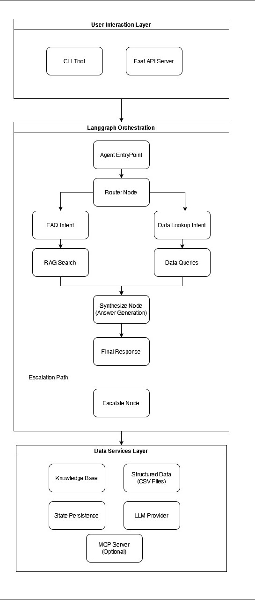

# NovaCRM Agentic AI - System Architecture

## Overview
NovaCRM is an intelligent customer support agent built using LangGraph that handles customer queries through intent routing, RAG-based knowledge retrieval, and structured data lookups.

---

## High-Level Architecture



---

## Component Details

### 1. User Interaction Layer

#### CLI Tool (`app/cli.py`)
- Command-line interface for testing
- Accepts account ID and temperature parameters
- Direct integration with LangGraph agent

#### FastAPI Server (Planned)
- RESTful API endpoints
- `/account_lookup`, `/invoice_status`, `/ticket_summary`, `/usage_report`
- `/kb_search` for knowledge base queries

#### Streamlit UI (Planned)
- Web-based chat interface
- Real-time conversation with agent
- Display of retrieved context and confidence scores

---

### 2. LangGraph Orchestration Layer

#### State Management (`AgentState`)
```python
{
    "user_query": str,           # Original user input
    "account_id": str,           # Customer account
    "intent": Literal["FAQ", "DataLookup", "Escalation"],
    "retrieved_docs": List[str], # RAG results
    "tool_calls": List[Dict],    # Structured data calls
    "final_answer": str,         # Generated response
    "confidence": float,         # Model confidence (0-1)
    "notes": str                 # Debug/escalation info
}
```

#### Node Functions

**Router Node** (`route_intent_node`)
- Analyzes user query using LLM
- Classifies intent: FAQ, DataLookup, or Escalation
- Routes to appropriate handler

**Retrieve Node** (`retrieve_knowledge_node`)
- Performs semantic search on FAISS vector store
- Retrieves top-k relevant documents
- Attaches to state for synthesis

**Tool Call Node** (`run_tools_node`)
- Parses structured queries (account, invoice, ticket, usage)
- Loads CSV data using pandas
- Filters and formats results

**Synthesize Node** (`synthesize_answer_node`)
- Combines retrieved context + tool results
- Generates natural language response
- Assigns confidence score
- Escalates if confidence < 0.5

**Escalate Node** (`escalate_fallback_node`)
- Handles low-confidence scenarios
- Provides diagnostic notes
- Routes to human support

---

### 3. Data & Services Layer

#### Vector Store (FAISS)
- **Index Type**: Flat L2 similarity
- **Embedding Model**: OpenAI `text-embedding-ada-002`
- **Documents**: 7 markdown files from `data/kb/`
- **Files**:
  - `index/index.faiss` - Vector index
  - `index/index.pkl` - Metadata (sources, chunks)

#### Structured Data (CSV)
- **accounts.csv**: Customer profiles, plans, status
- **invoices.csv**: Billing records, amounts, periods
- **tickets.csv**: Support tickets, status, priority
- **usage.csv**: API/service usage metrics

#### LLM Provider
- **Model**: OpenAI GPT-4 (via `ChatOpenAI`)
- **Temperature**: 0.0 (deterministic)
- **Prompts**: Loaded from `app/prompts/`
  - `router.md` - Intent classification
  - `rag_synth.md` - FAQ synthesis
  - `tool_check.md` - Data query synthesis
  - `system.md` - System instructions

#### State Persistence
- **SQLite Checkpointer** (`state.db`)
- Maintains conversation history
- Enables multi-turn interactions
- Thread-safe with `check_same_thread=False`

---

## Data Flow

### Example: FAQ Query
```
User: "What are your pricing plans?"
  │
  ▼
Router Node → Intent: "FAQ"
  │
  ▼
Retrieve Node → FAISS search → Returns "pricing_plans.md" chunks
  │
  ▼
Synthesize Node → LLM generates answer from retrieved docs
  │
  ▼
Response: "We offer three plans: Starter ($29/mo), Pro ($99/mo), Enterprise (custom)..."
```

### Example: Data Lookup Query
```
User (Account A001): "What's my current invoice status?"
  │
  ▼
Router Node → Intent: "DataLookup"
  │
  ▼
Tool Call Node → Query invoices.csv for account_id="A001"
  │
  ▼
Synthesize Node → LLM formats structured data into natural language
  │
  ▼
Response: "Your November 2024 invoice (#INV-2024-11-001) for $250.00 is paid."
```

### Example: Escalation
```
User: "I need help with a complex integration issue"
  │
  ▼
Router Node → Intent: "Escalation" OR Low confidence
  │
  ▼
Escalate Node → Human handoff
  │
  ▼
Response: "I'm escalating this to our technical support team. Ticket #..."
```
## File Structure

```
capstone-agentic-ai/
├── app/
│   ├── cli.py              # Command-line interface
│   ├── graph.py            # LangGraph orchestration
│   └── prompts/            # LLM prompt templates
│       ├── router.md
│       ├── rag_synth.md
│       ├── tool_check.md
│       └── system.md
├── data/
│   ├── accounts.csv        # Customer accounts
│   ├── invoices.csv        # Billing data
│   ├── tickets.csv         # Support tickets
│   ├── usage.csv           # Usage metrics
│   └── kb/                 # Knowledge base markdown
│       ├── api_guide.md
│       ├── billing_module.md
│       ├── campaigns_module.md
│       ├── overview.md
│       ├── pricing_plans.md
│       ├── security_faq.md
│       └── support_module.md
├── index/
│   ├── index.faiss         # Vector index
│   ├── index.pkl           # Metadata
│   ├── faiss_chunks.npy    # Text chunks
│   └── faiss_sources.npy   # Source files
├── scripts/
│   └── build_index.py      # Index builder
├── servers/
│   └── mcp_nova/
│       ├── server.py       # MCP server
│       └── tools/          # Tool implementations
│           ├── __init__.py
│           ├── accounts.py
│           ├── invoices.py
│           ├── tickets.py
│           ├── usage.py
│           └── knowledge_base.py
├── .env                    # Environment variables
├── .gitignore             # Git ignore rules
├── requirements.txt       # Python dependencies
├── state.db              # SQLite checkpoint store
└── README.md             # Project documentation
```

---

## Key Design Decisions

### 1. Intent-Based Routing
- Enables specialized handling for different query types
- FAQ queries leverage semantic search (RAG)
- Data queries use structured lookups (CSV)
- Escalation path for ambiguous/complex requests

### 2. Hybrid Retrieval
- **RAG (FAISS)**: Unstructured knowledge (docs, FAQs, guides)
- **Structured Queries**: Tabular data (accounts, invoices, tickets)
- Combines best of both approaches

### 3. Confidence-Based Escalation
- Prevents hallucinations by routing uncertain responses to humans
- Configurable threshold (default: 0.5)
- Includes diagnostic notes for support agents

### 4. State Persistence
- SQLite checkpointer maintains conversation context
- Enables multi-turn dialogues
- Supports conversation resumption

### 5. Modular Tool Architecture
- MCP server separates business logic from orchestration
- Individual tool files for maintainability
- Reusable across CLI, API

---
